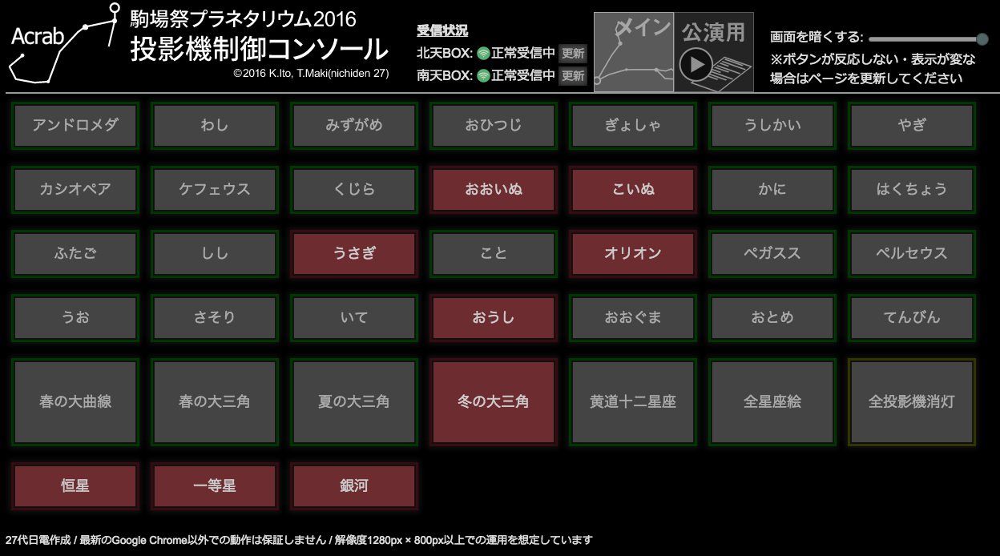

# 無線制御(Acrab)
- 書いた人: Kenichi Ito(nichiden_27)
- 更新: Hanaka Satoh(nichiden_28)
- 更新日時: 2017/05/06
- 実行に必要な知識・技能: Web制作、JavaScript
- タスクの重さ: 3/数週間
- タスクの必須度: 4/毎年やるべき

## 概要
`Acrab`は、27代で開発した投影機無線操作用Webアプリケーションです。
最新のブラウザ(Chrome推奨)があれば、どんな環境でも使うことができます。

名称は、ブラウザで星座絵などを操れることからApplication for Constellation Remote controlling Assistance on Browserの頭文字をとりました。
さそり座β星の固有名でもあります。

## 使い方
### 下準備
まず、[Acrabの各種ファイル](https://github.com/Triangulum-M33/nichiden28/tree/master/ACRAB)を同じフォルダに配置する。
ファイルの読み込みにAjaxを使っているので、index.htmlをそのまま開いただけ(file:///)では機能が使えない。
回避方法は「Ajax ローカル」などとググれば複数出てくるが、ローカルにWebサーバを立てる方法を解説する。

Windowsでローカルホストを立てるには、[XAMPP](https://www.apachefriends.org/jp/index.html)を使うのが簡単だ。
GUIなので、操作も分かりやすいだろう。XAMPPの設定については[xamppでローカル作業環境構築をしよう](http://creator.aainc.co.jp/archives/6388)や[XAMPPで任意のディレクトリをバーチャルホストにする方法](https://qiita.com/nbkn/items/e72b283c54403a30b2e1)等が参考になるだろう。

MacならApacheが標準で入っているはずなので、`sudo apachectl start`を打てば`httpd`が動き出す。
設定については、ググれば役に立つ情報が得られる。

### 起動と接続
localhostにアクセスすれば以下のような画面が表示されるはずだ。
もしボタンに日本語が表示されない場合、設定ファイルの読み込みに失敗しているので再読み込みすること。



次に、`Piscium`との接続を確認する。
`Piscium`の電源が入っていて、Wi-Fiネットワークに接続していれば、画面上の「受信状況」が緑色に変わるはずだ。

もし「接続なし」のままなら、PCと`Piscium`が同じLANに接続しているか(PCが別のルーターに接続してしまうミスは結構ある)、受信モジュールのIPアドレスが正しいかなどを確認しよう。
「受信状況」欄右の更新ボタンを押すと、`Piscium`へのリクエストが再送される。

無事接続できたら下に並ぶボタンを押して投影機をオンオフさせてみよう。
投影機を繋いでいなくても、コマンド自体は送ることができる。
`Piscium`から応答が来なかった場合はボタンの色が変わらないので、不具合に気づける。

### 公演用画面
ソフトの指示を次へ・前へのボタンで実行できるモード。
画面上に「**公演用**」ボタンがあり、押すと画面が切り替わる。


左上のメニューから番組名を選べるので、選んでから「**開始**」ボタンを押すと一番初めのコマンドが送信される。
下にタイミングが表示されるので、緑色の「**次へ**」ボタンを押して番組を進行する。
「**前へ**」ボタンでは、直前と逆の指示を送信できる。
「**Skip**」ボタンでは、番組は進行するが、指示は送信されない。番組進行者が「次へ」ボタンをうっかり押し忘れた時等に使う。

「開始」した後は左のボタンが「**停止**」「**再開**」に変化するが、これは右上のタイマーが止まるだけで深い意味はない。
「**リセット**」ボタンを押すと、タイマーと番組の進行状況が最初に戻る。

誤操作防止のため、「リセット」は「停止」状態でないとできない。
また、番組選択メニューは「リセット」しなければ操作できない。

## プログラム
`Acrab`はWebの技術を使って通信や画面表示を行っている。
画面の情報はHTML、デザインはCSS、内部処理や画面の書き換えはJavaScript(以下JS)という構成だ。

### ファイル構成
以下のようなディレクトリ構成になっている。
ファイルを動かす際はリンク切れに注意すること。
```
ACRAB
├── acrab_conf.json
├── img
│   ├── acrab-banner.svg
│   ├── main_01.png
│   ├── main_02.png
│   └── (省略)
├── index.html
├── js
│   ├── acrab_main.js
│   ├── acrab_scenario.js
│   └── jquery-3.1.0.js
├── scenario
│   ├── 0.json
│   ├── 1.json
│   ├── (省略)
│   └── csv
│       └── (省略)
├── style.css
└── testscript.json
```
`index.html`がAcrabのメインページである。
デザイン関連の記述は`style.css`に分離した。
`acrab_conf.json`には、各種設定が格納されている。

`img/`以下にはページで使用した画像、`js/`以下にはJavaScriptのコードが入っている。
`scenario/`内は、番組の指示書を指定形式で入力したデータ。

### 技術要素
#### HTMLとCSS
最近のWebアプリは、サーバ側でHTMLファイルを動的に生成して送ってくることが多い。
しかし、`Acrab`は**静的なHTMLファイルを準備し、クライアント(ブラウザ)側で書き換える**方式を採っている。
単に開発が楽であること、サーバ側で作業する必要がないこと、多数のユーザに後悔するような規模でないことがその理由である。

`Acrab`の**ページ構成**を変えたければ`index.html`を、**色やサイズ**なら`style.css`を編集すれば良い。
どちらもググれば分かる程度の機能しか使っていないつもりなので、Webの経験がなくても対応できるだろう。
それぞれの内容についてはここでは触れないが、JS部分と連動する箇所は都度解説する。

#### jQuery
プログラムにはJSを用いていると書いたが、素のJSだけで書くと記述が長くなってしまう。
そこで、jQueryというライブラリを採用している。
動的なページの書き換えやAjaxによるファイル取得などを簡単に書けるようになり、コードを読みやすくできる。

近頃のWebアプリはサーバ側が急速に発展し、jQueryは不要な存在となりつつあるが、`Acrab`はクライアントサイドだけで動作する仕様のためあえて採用した。
数年前の流行りとはいえネット上に解説記事が充実しており、学習が容易であることも採用の理由だ。

jQueryは単一のjsファイルにまとめて配布されるので、最新版をダウンロードして`js/`内に入れておけば使えるようになる。
わざわざダウンロードしておくのは、ネットに接続できない本番ドーム内などでもjQueryを取得できるようにするため。

jQueryの機能は解説しないのでググって補完されたい。
`acrab_main.js`や`acrab_scenario.js`内に頻繁に登場する`$`という文字は、jQueryを呼び出すためのものである。
`$.(メソッド名)`といった形式で各種メソッドを使用できる。

#### JSON
`Acrab`では、各種設定を個別ファイルに分離している。
投影する星座の名称を変えたい、指示書を編集したいと言った要求はいつ来てもおかしくない。
こうした変更に迅速に対応できるよう**JSON**形式の設定ファイルを読み込む方式とした。

JSON(JavaScript Object Notation)は、JavaScriptのオブジェクトの形式でデータを記述するものである。
「JavaScriptのオブジェクト」というのは配列や連想配列を入れ子にした構造を指す。
```js
{
  "hoge": [ 1, null ],
  "fuga": {
    "one": [ true, "tenmon" ],
    "two": "nichiden"
  }
}
```
上の例のように、項目にラベルを付ける、入れ子にするといったことが比較的シンプルな記述で可能になる。
また、オブジェクトなので`.`でラベル名を繋ぐだけでデータを取り出せる(例: `fuga.one[1]`は`"tenmon"`)。
文法がJavaScriptからの流用なので親和性がよく、読み込みが簡単なのも嬉しい。

ただ、文法がたいへん厳しくかつ目で眺めてもミスに気づきにくいので、パースエラーが出ないことを確かめてから使うよう心がけたい。
[JSONLint](http://jsonlint.com/)など、JSONの文法ミスを検出してくれるサービスが存在する。

また、`Acrab`では、JSON形式の指示書の一覧を`scenario_list.json`というJSONファイルにして、`ACRAB`ディレクトリ内に配置している。
これは、`Acrab_scenario.js`が指示書の個数やタイトルを読み込むのに必要なファイルであり、`GRAFFIAS`によって簡単に生成することができる。

### 指示書の検討
PCで投影機を操作する場合、指示書の内容が表示されていると便利なのは言うまでもない。
しかし、コードに直接書き込むような方式では、翌年にはもう使えなくなってしまう。
そこで、`Acrab`が**外部の指示書ファイルを読み込む**方式を検討した。

#### 指示書をどう表現するか
ソフトの指示書には様々な情報が書かれているが、主投影機に限れば必要な情報は

- 順番
- セリフ
- タイミング
- 指示
    + どの投影機を
    + 点灯する/消灯する

となる。
一公演に対して普通は多数のセリフが存在し、また一つのセリフに複数の投影機への指示がつくこともある。
つまり、「番組」→「セリフ(タイミング)」→「指示」と**階層的に表現**できればとても嬉しい。

ソフトは指示書をExcel(xlsxファイル)で作成している。
xlsxファイルはかなり複雑で、プログラムから読むのは大変なので、テキスト形式のデータに変換したい。

エクセルならCSVが扱えるが、CSVは表形式のデータとなり階層構造が表現できない。
階層状にできるXMLかJSONのうち、XMLは扱いづらそうだったため**JSON**を採用した。
JSONならばJavaScriptの`Acrab`との親和性もある。

具体的にどのような構造のJSONかについては、ソースコード解説の記事にゆずる(概ね上の箇条書きの通りと思ってよい)。

#### エクセルからJSONデータへ
指示書のデータはソフトが持っているので貰ってくるとして、一発でJSONに変換できる訳ではない。
日本語の指示を**プログラム用の形式にする**作業が待っている。

とはいえ、JSONを手で書くのは非常に面倒で、しかもミスがあるとパースができない。
そこで28では`GRAFFIAS`という、JSON作成を補助するGUIを作成・使用した。
`GRAFFIAS`の使用法・解説については長くなるので、[GRAFFIASの記事](graffias.html)に分離する。

### ソースコード解説
たいへん長くなるので、[Acrabの実装解説](acrab-code.html)に分離する。

## 今後の展望
### 既知の問題
#### 同時多数点灯対策でごちゃごちゃしている
27の本番近くになり、星座絵の突入電流で電源が不安定化するのを避けるため`each_slice()`や`sleep_ms()`を急遽追加した。
これでも動作はするが、こういった処理はマイコン側でする方が簡単である(sleep関数も用意されている)。
直前に追加したことでコードが読みにくくなっているので、**無線受信機側で小分けにして点灯**するような対策に切り替えるのが良いだろう。

#### 星座のグループが正しく点灯・消灯しない
28の公演中、公演用画面で夏の大三角・冬のダイヤモンドと言った星座グループについて点灯・消灯を指定してもこれが反映されない問題が発生した。
後にこれは`acrab_scenario.js`でのコードのミスだと判明したが、修正する時間が足りなかったのでJSONを書き換えて星座グループを使用しないことで無理矢理対応した。
詳しくは[Acrabの実装解説](acrab-code.html)で説明しているので、修正をお願いしたい。

#### 画面レイアウトの改善
28では、27に比べ表示する星座絵の数が増えたため、ボタンの幅を狭めるなどしてこれに対処したが、これを別PCの画面で見ると表示ずれが起きることがあった。
これはおそらくPCの画面サイズの違いが原因だと思われるので、余裕があれば他のPCでも表示テストをしてみるといいかもしれない。
また、「前へ」・「次へ」ボタンは中のテキストによって横幅が変わる仕様(`Flexbox`による)だが、これにより「次へ」ボタンの一部が画面からはみ出すことがある。
cssを調整する、`GRAFFIAS.php`を弄って改行コードを有効にする等して対応してほしい。(MacとWindowsでも表示異なる可能性あり…？要検証)
Skipボタンについても、とりあえず「次へ」ボタンの右側に配置してみたが、本番で一度押し間違いがあったようなので配置を変更した方がいいかもしれない。(そもそも担当者が本番中に寝落ちしなければ不要説も…)
求むデザインセンス。

#### フルスクリーン機能について
28の公演中に`Acrab`画面外のアドレスバーの光が漏れていたことがあったので、プログラム的に弄るべきところはないがここに記載しておく。
`Acrab`は`Google Chrome`上で動かすことを前提としたアプリであるため、`Google Chrome`の**フルスクリーン**機能が使える。
Windowsでは`F11`、Macでは`shift+command+F`でフルスクリーンにできる。当日、公演用のPCを持ってきてくれた人に伝えておくといいだろう。
あと、`Acrab`はマウスを使うと操作しやすいので、誰がマウスを持ってくるかをちゃんと割り当てておこう。

### 追加機能案
#### 設定画面の改善・機能追加
`Acrab`は、メンテナンス性・拡張性を高めるために各種設定をプログラムとは別のファイルに保存している。
しかし、設定ファイル自体の読み書きがプログラマにしかできないようでは、その変更は結局日電メンバの仕事となる。
そこで28日電では指示書のJSONファイル作成補助として`GRAFFIAS`を製作した。

ローカルにWebサーバを立てると、大体の場合**PHPも動く**ようになる。
PHPならサーバのファイルに書き込めるので、設定用のJSONファイルを読み込んで画面に表示し、修正して書き込むということが可能だ。
JSONの入出力については[PHPでJSONのデータを処理する方法](https://syncer.jp/how-to-use-json)など詳しい記事を参照のこと。

現状では指示書用JSONの作成補助と、作成したJSONファイルの一覧を作る機能しかない簡素なものだが、今後は、`acrab_conf.json`の書き換えにも対応した設定画面を作る、受信機や投影機の数の増減にも対応できるよう、行の追加・削除ができる表のような仕掛けを用意するなどしてもいい。
色々と工夫の余地がありそうなところだ。

#### デスクトップアプリ化
最近Web界で流行っている`Electron`という技術を使うと、Webの作法を使ってクロスプラットフォーム(Win/Mac/Linux)のアプリが組める。
`Acrab`は基本的にサーバサイドで処理をしないので、移植しようと思えばできるだろう。
Web技術が大好きor勉強してみたいのであれば、やってみてはいかがだろうか。

参考: [WebアプリをElectronに乗せる](https://www.slideshare.net/hiroyukianai/webelectron)