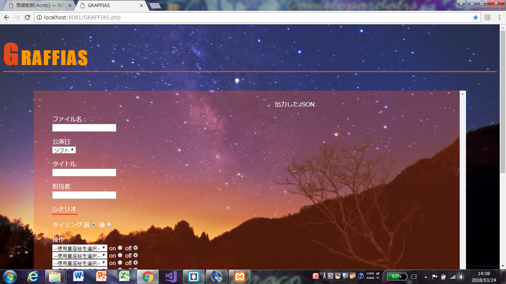
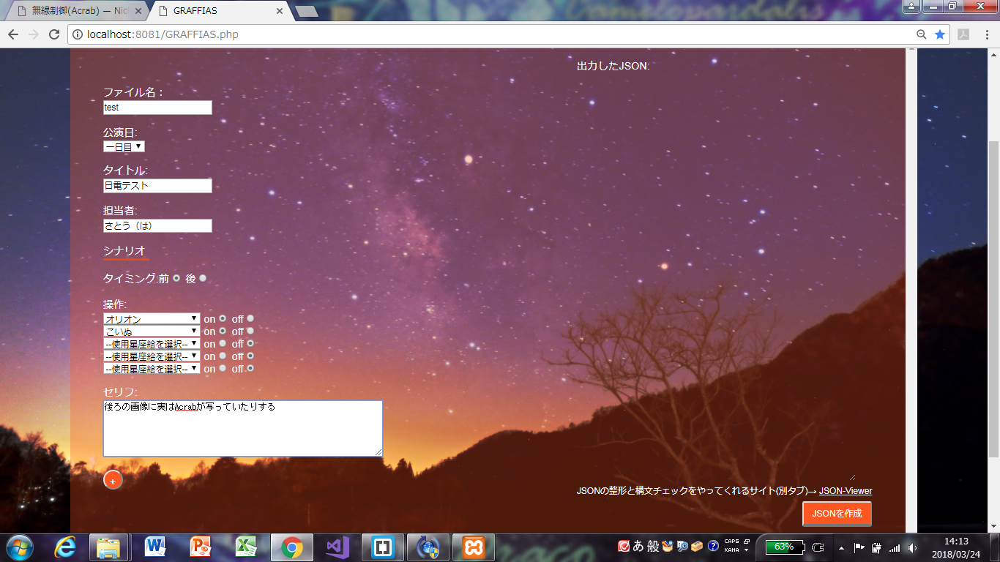

# 無線制御(GRAFFIAS)
- 書いた人: Hanaka Satoh(nichiden_28)
- 更新日時: 2018/08/26
- 実行に必要な知識・技能: Web制作、JavaScript、php
- タスクの重さ: 2/数日かかる
- タスクの必須度: 4/毎年やるべき

## 概要
`GRAFFIAS`は28代で開発した指示書作成補助用Webアプリケーションです。現状、`Acrab`で使用するJSON形式の指示書を作成しやすくする機能のみを持ちます。
最新のブラウザ(Chrome推奨)があれば、どんな環境でも使うことができます。

`Acrab`の補助として用いることから、さそり座β星`Acrab`の別名である`Graffias`から名前を取っていますがあまり深い意味はありません。`Graffias`はラテン語で「爪」を意味するそうですが本アプリに爪要素は一切ありません。

※無線制御と直接関係はしませんが、性質上`Acrab`から切り離せないアプリなので無線制御の項に分類しました。

## 使い方
### 下準備と起動
使いはじめる前に、その年に使用する星座絵を`GRAFFIAS.php`に入力する必要がある。`GRAFFIAS.php`内のHTML部分に、
```html
<select id="projector_a[0]" name="projector_a[0]">
    <option value="XXX">--使用星座絵を選択--</option>
```
などと書かれた部分がある。(`projector`は5個まで用意しているので計5か所、1か所書いてコピペすればよい)
この後に、使用する星座絵及び星座グループを、(※ただし、2017年現在Acrab側の不具合により現状星座グループ指定は行えないので注意)
```html
<option value="Lep">うさぎ</option>
```
のように、`<option value="(三文字コード)">(星座名か星座グループ名)</option>`の形で書いていく。
`ACRAB`ディレクトリ内に、`88星座+略符一覧.txt`という三文字コードと星座名の対応を書いたテキストファイルを置いておいたので参考程度にどうぞ。

書き換えが終わったら、`GRAFFIAS`を使う環境の整備を行う。
`GRAFFIAS`はphpで書かれているので、`Acrab`と同様にローカルにWebサーバを立てないと使えない。
ローカルにWebサーバを立てる方法としては[Acrabの使い方#下準備](acrab.html)を参照のこと。`Acrab`本体とはルート環境を別にしておこう。

なお、`GRAFFIAS`のみを別のPCで使うときは、`Acrab`ディレクトリ内の`GRAFFIAS`ディレクトリのみを移せば使える仕様になっている。
これにより、プログラミング担当者以外の人や日電メンバー以外にも指示書作成を手伝ってもらえる…といいなあ。

localhostにアクセスすると、以下のような画面が表示される。



### 操作
#### JSONファイルの作成
`GRAFFIAS`で作成しようとするJSONの構造は以下のとおり。
```
├── "info" [番組情報]
│   ├── "day" [(ライブ解説の場合)何日目か]
│   ├── "title" [番組名]
│   └── "name" [担当者名]
└── "scenario" [配列: 指示が入る部分]
    ├── 0
    │   ├── "word" [セリフ: 0番目は空欄にする]
    │   ├── "timing" [タイミング: 0番目は空欄にする]
    │   └── "projector" [投影機]
    │       ├── "(三文字コード)" [点灯なら1/消灯なら0]
    │       └── (以下同様)
    ├── 1
    │   ├── "word" [セリフ]
    │   ├── "timing" [タイミング]
    │   └── "projector" [投影機]
    │       ├── "(三文字コード)" [点灯なら1/消灯なら0]
    │       └── (以下同様)
    └── (以下同様)
```
`GRAFFIAS`の画面上の各フォームは、このJSONの構造に対応している。



- ファイル名…JSONファイルのファイル名。自由に決めていいが、タイトルと一致させた方が分かりやすいと思われる。
- 公演日…`day`と対応。セレクトボックスから一日目～三日目、ソフトのいずれかを選ぶ。
- タイトル…`title`と対応。番組名を入力する。
- 担当者…`name`と対応。担当者の名前を入力する。ソフト製作の番組の場合、空白にしておくといいだろう。
- シナリオ以下…`scenario`以下に対応する。下のプラスボタンを押せばフォームが増え、マイナスボタンを押せば直前のフォームが消える。0番目は「JSONを作成」ボタンを押した時に自動生成されるので、入力不要である。
- タイミング…`timing`と対応。セリフの前か後かを選択できるようにしたが、その他の「セリフの3秒ほど後」のような指示は`GRAFFIAS`上では対応できないので、出来上がったJSONに手入力することになる。
- 操作…`projector`と対応。星座絵と、その星座絵のon/offを選択する。入力ミスが一番多いところなので注意。
星座のグループも選択できるが、Acrabがこれに対応できていないので現状無効である。詳しくは[Acrabの実装解説#acrab_main.js](acrab-code.html)参照のこと。
- セリフ…星座絵点灯/消灯の合図となるセリフ。エクセルからコピペ可。

情報を入力していると、指示書の曖昧な点や不明点、矛盾点が見えてくることもある。これらは入力中にソフトの人やライブ解説担当者に問い合わせて、できるだけ潰しておくといいだろう。

全ての情報を入力し終わったら右下の「JSONを作成」ボタンをクリックする。
すると、JSONファイルが`GRAFFIAS/scenario`ディレクトリ内に作成される。

実は、このままでは**AcrabからJSONファイルを参照できない**ため、JSONファイルが揃ったら、
**ACRAB/scenarioディレクトリ内にJSONファイルをコピーして使う**のが必須となる。  
なぜこんな面倒な仕様なのかというと、`GRAFFIAS`は、`GRAFFIAS`のみをコピーしてプログラム担当ではない人に渡して使ってもらうことを想定しているためである。
年にもよるが、基本的に指示書の数は多いうえに大体本番ギリギリにならないと揃わない。このため、とにかく作業人数が多いほど本番直前の負担が減る。よって、`GRAFFIAS`ディレクトリのみをコピーして複数人に渡し、各自の`GRAFFIAS/scinario`内に出力されたJSONを、USBなりLINEなりメールなりでJSONを取りまとめる人に送信する…ということを考えた。
全員がGitを使いこなせれば無問題な気もするが、そういう専門知識のない人にも容易に使えるような仕様を目指したのでこうなった。

#### JSONリストの作成
全ての番組のJSONファイルを作成し終わったら、`GRAFFIAS/scenario`ディレクトリに全ての番組のJSONファイルがあることを確認する。
**GRAFFIASディレクトリがACRABディレクトリの直下にあることも確認する。**

ここまで確認できたら、`GRAFFIAS`の画面で「**↑↑↓↓←→←→BA**」と入力すると、画面一番下の右側(赤っぽいエリアの外)に赤い「JSONリストの作成」ボタンが表示される。
これをクリックすると、`ACRAB`ディレクトリ内に`scenario_list.json`が作成される。  
既に`scenario_list.json`がある状態で押すと、これが上書きされる仕様。
このため直前のタイトル変更にもササッと対応できる。  
`scenario_list.json`は、`Acrab`がサーバにある指示書ファイルの数を知るために使われる。詳しくは[Acrabの実装解説#acrab_main.js](acrab-code.html)参照のこと。

## プログラム
`GRAFFIAS`はWebの技術を使って内部処理や画面表示を行っている。
画面の情報はHTML、デザインはCSS、画面の書き換えはJavaScript(以下JS)、内部処理やファイルの生成はphpという構成だ。  
phpの仕様上、HTMLは`GRAFFIAS.php`の中に書いてある。基本的にはphpをプログラム前半に、HTML部分をプログラムの後半に書いてあるので、編集時はそれぞれを参照してほしい。  

プログラムの細かい仕様については説明を省くが、要所については説明を加えておく。

### GRAFFIAS.phpの実装解説(HTML部)
`GRAFFIAS`では、入力された情報を受け取るのに、HTMLの`<FORM>`タグを使用している。`<FORM>`タグ内にラジオボタン、セレクトボックス、テキストボックス等を配置し、入力された情報を
    
```html
    <form id="frm" name="frm" action="GRAFFIAS.php" method="post" >
```
で`GRAFFIAS.php`に送信する。送信したデータをphp部分で処理するという流れだ。php部分の説明は後述。
        
```html
<select id="projector_a[0]" name="projector_a[0]">
```
等のセレクトボックスについては、セレクトボックスの中身をいじれば、その年に使用する星座にも対応できる。
セレクトボックスの中身を操作するようなGUIは、時間の都合上作ることができなかったので、もし余裕があったら考えてみるのもいいかもしれない。(GUIを丸ごと作り直した方が速いかもしれないが…)  
他のHTML部については、後述する`script.js`に関連する部分以外は、基本的にググればすぐ分かる程度の内容しか書いていないため、割愛する。

### script.jsの実装解説
一旦`GRAFFIAS.php`からは外れるが、`GRAFFIAS.php`のフォームの追加・削除機能に関する部分である、`script.js`の解説に入る。

`GRAFFIAS.php`には、フォーム追加用の+ボタンと、フォーム削除用の-ボタンがあるが、これは`GRAFFIAS.php`のみではただのボタンであり、何の機能もない。
これにフォームを追加/削除し、現在のフォームの数を変数を用いカウントして`GRAFFIAS.php`に渡すのが`script.js`の主な役割である。

また、`script.js`には`jQuery`が使われている。これは`Acrab`関連のjavascriptを触った人ならお馴染みであろう。ネット上に参考文献が大量にあるので分からない場合は参照してほしい。
今回は[こちらのページ](https://qiita.com/SiskAra/items/5f4bc7ee4e598b863add)を参考にした…というかほとんど丸パクしたのでまずリンク先を参照してほしい。

- `$(obj).attr('id').replace(/\[\d{1,3}\]+$/, '[' + frm_cnt + ']')`などの`/\[\d{1,3}\]+$/`の部分は「正規表現」と呼ばれる表記である。  
ここだけではなく、日電が作成した他のプログラムにも含まれている…し、プログラミングに関わったことがあるなら見たことがあるかもしれない。  
表記がややこしいので、[参考文献へのリンク](https://www.sejuku.net/blog/20973#i-3)を貼っておく。  

```js
 $('#send_button').click(this,function(){
        document.forms['frm'].elements['count'].value = frm_cnt + 1;
        document.frm.submit();
    });
```
上記の部分は、「JSONを作成」ボタンを押した時に、現在のフォームの数を、`script.js`内でフォームの数を数える変数である、`frm_cnt`の数に1を足した数として`GRAFFIAS.php`内のHTML部に組み込むためのコードである。これは、javascriptで変更したフォームの数を、どうしてもphp側で参照できるようにしたかったからである。
色々と調べてはみたが、作成者の技術では、javascript→HTML→phpという流れで受け渡す方法しか思いつかなかったのでこの仕様である。もっとスマートな方法もあるのかもしれない。

```js
var inputKey = [];
     var konamiCommand = [38,38,40,40,37,39,37,39,66,65];
     $(window).keyup(function(e) {
        inputKey.push(e.keyCode);
        if (inputKey.toString().indexOf(konamiCommand) >= 0) {
            $('#listmake').css("display","inline");
            inputKey = [];
        }
      });
```
…上記の部分は、完全にお遊びで入れてしまった部分である。指示書用のJSONを全て作成し終わった後、`Acrab`から参照できるように、JSONの一覧をまとめたJSONファイルを作らないといけないのだが、このJSONリストを作る機会は少ない。というか基本1回しかない。  
このため、隠しコマンドでJSONリスト作成用のボタンが出せたらいいな…隠しコマンドと言えばコナミコマンドかな？という発想から付け足しただけである。(と思ったが同世代に伝わらなかった)世の中同じことを考える人は多いようで、「コナミコマンド　javascript」でググるといろいろ文献が出てくる。このコードもネット上から引っ張ってきた。

### GRAFFIAS.phpの実装解説(php部)
さて、ここからが本題のphp部分になる。php初学者が何とか動くように1週間で無理矢理書き上げたものなので、非常にエラーが多いことに留意していただきたい。  
冒頭の、`ini_set('display_errors', "Off");`をコメントアウトすると、phpの実行時にエラーが表示されるようになる。デバッグ時の参考にしてほしい。

#### FORMから送信されたデータの変数への格納

```php
if(isset($_POST['filename'])){
    $filename = $_POST['filename'];
    //echo $filename;
```
上記の形式で記述した部分は、入力された内容をphp部で扱う変数に格納する役割だ。  
コメントアウトしている`echo`部は出力が正しいかのテスト時に使える。  
セリフ、タイミングにあたる`word`、`timing`や星座絵にあたる`projector`、各フォームのON/OFFボタンにあたる`on_off`については、配列として格納している。
これは、1つの指示書内にこれらが複数あるからである。  
また、現在のフォーム数もこの形式で受け取って、`$count`という変数に格納している。  
ここで注意してほしいのが、`projector`については、1個目のフォームの、1番上の星座絵用セレクトボックスがprojector_a[0]、1個目のフォームの、上から2番目のものは**projector_a[1]ではなく、projector_b[0]**になるということである。`on_off`のラジオボタンも同じ仕様になっている。  
あらかた作った後で、この分かりにくさに気が付いてしまったが時間的に修正できなかったのでこのままである。非常に分かりにくい仕様になってしまって申し訳ない。

#### JSONファイルとして出力するための雛形の作成

```php
$DATA_ARRAY = array(
    "info" => array(
        "day" => $day,
        "title" => $title,
        "name" => $staffname,
    ),
    "scenario" => array( 
        array(
            "timing" => "",
            "word" => "",
            "projector" => array(
                "Fst" => 1,
                "Gxy" => 1,
             ),
        ),
    ),
);
```
上記の部分は、JSONファイルを作成する際のいわば初期設定にあたる部分を作るためのものである。指示書用のJSONファイルをいくつか見てもらえればすぐ分かると思うが、
各JSONファイルの冒頭部は`day`、`title`、`name`以外は全て一致している。この部分を配列として作成するのが上記コードである。この雛形に、他の星座絵やそのON/OFFについての
情報を加えていき、最終的にJSONとして出力する形である。この部分の記法については[こちらのページ](https://syncer.jp/how-to-use-json)が大いに参考になった。

```php
$word = str_replace(array("\r", "\n"), '', $word);
```
このコードはセリフ部分に書き込まれた内容から、改行コードを削除するためのものである。載せる場所に困ったので、ここに記載する。
セリフ部分に改行が入っていると指示書中に変な文字化けが発生することが指示書作成中に発覚したため、急遽追加した箇所である。
これにより、改行コードによる文字化けは防げるようになったが、同時に、そもそもセリフが改行されなくなるというデメリットも発生するようになった。(当然だが)
具体的には、長いセリフの場合にAcrab上で読みにくくなる、Acrab上で「次へ」/「前へ」ボタンが大きく横に伸びてしまうことがあるなどの点が欠点である。
このコードを置き換える、削除する、AcrabのCSSをいじってデザイン面からなんとかする…等の対応をしてほしいところである。

#### 星座絵用セレクトボックスで、星座が未選択の場合の配列からの削除

```php
for($n = 0;$n < $count; $n++){
        if($projector_a[$n] == "XXX"){
            unset($projector_a[$n]);
            unset($on_off_a[$n]);
        }
        if($projector_b[$n] == "XXX"){
            unset($projector_b[$n]);
            unset($on_off_b[$n]);
        }
        if($projector_c[$n] == "XXX"){
            unset($projector_c[$n]);
            unset($on_off_c[$n]);
        }
        if($projector_d[$n] == "XXX"){
            unset($projector_d[$n]);
            unset($on_off_d[$n]);
        }
        if($projector_e[$n] == "XXX"){
            unset($projector_e[$n]);
            unset($on_off_e[$n]);
        }
        
    }
```
星座絵がセレクトボックスで選択されている場合、各星座に対応した3文字のアルファベットがphp側に送信されるが、未選択の場合は`XXX`を送るように割り当てている。
そこで、配列である`$projector`と`$on_off`の中から、`XXX`に対応する部分を削除するためのコードが上記のコードである。
これで一応はちゃんと動くのだが、冒頭で触れた**大量のエラーの一番の原因**となっている部分でもある。もっと良い方法がある気がしてならないが、作成者の知識ではこれが限界だった。

#### on/off関連の配列作成

on/offラジオボタンの情報(0か1)は配列として格納しているが、実はこの情報は数値としての`int型`ではなく、`string型`として格納されている。これを、
```php
$on_off_int_a = clone_int($on_off_a);
...
function clone_int($array){
        if(is_array($array)){
            return array_map("clone_int",$array);
        }else{
            return intval($array);
        }
    }
```
と、上記の記述でint型の配列に作成しなおしている。

#### scinarioの中に入れる配列の作成とJSONの出力

ここまでで`scenario`に入れるデータの用意が全て終わったため、`scenario`以下の配列を作る。
```php
$DATA_ARRAY["scenario"][$i]["projector"] = array_filter($DATA_ARRAY["scenario"][$i]["projector"],"strlen");
```
上記の記述は`projector`内の空の要素を一括で削除するものである。

配列が出来上がったら、あとはJSONを出力するのみ。
```php
$make = json_encode($DATA_ARRAY,JSON_UNESCAPED_UNICODE|JSON_PRETTY_PRINT);
```
上記の記述だけで、ここまで作ってきた配列($DATA_ARRAY)をJSONに変換して出力できる。後半は出力形式の指定なので、正直おまじないに近い。何か追加したい人は別途調べてみてほしい。

出来上がったJSONファイルは、
```php
if($filename){
        file_put_contents("scenario/".$filename.".json",$make);
        $result = file_get_contents("scenario/".$filename.".json");
    }
```
の記述により、**GRAFFASディレクトリ内の**`GRAFFIAS/scenario`ディレクトリに、`(ファイル名).json`の形式でJSONが出力される。最初の方にも書いたが、このままでは`Acrab`から参照できないので注意。
実際に使う場合は、**ACRAB/scenarioディレクトリ内に、GRAFFIAS/scenarioディレクトリの中身をコピーして使う**こと。

#### JSONリストの作成
全てのJSON作成が終わったら、`Acrab`が参照できるJSONリストを、JSON形式で出力する。
```php
if(isset($_POST['listmake'])){
        foreach(glob("scenario/*.json") as $ListMake){
            $FileList[] = $ListMake;
    }
        for($j=0;$j<count($FileList);$j++){
            $FileListResult["scenariolist"][$j] = $FileList[$j];
        }
    $FileListMake = json_encode($FileListResult,JSON_UNESCAPED_UNICODE|JSON_PRETTY_PRINT);
    file_put_contents("../scenario_list.json",$FileListMake);
    }
```
上記の記述により、「JSONリストの作成」を押すとJSONファイルの一覧をJSON形式で出力したものが**GRAFFIASディレクトリの1つ上のディレクトリ**内に出力される。

## 今後の課題点
知識0からのスタート＆1週間弱で作ったプログラムなので、非常に課題点が多い。ここで挙げた点以外にも、何か気づくところあればどんどん修正なり、機能追加なりしてほしい。
よりよいものが作れそうであれば、もう原型残さず改造でいいレベルでもある。

- 使い始める前の、HTML部の書き換えが面倒。これをさくっと選択形式で直せるような仕様にすると後々楽かも…？
- 現状指示書を作る機能しかないので、 Acrabの方でファイルを書き換える作業には非対応。ただ、GRAFFIASは色んな人にGRAFFIAS単体で渡して使ってもらうのを想定しているので、そこまで作成するなら別でAcrab用設定画面UIを作った方が便利な可能性は高い
- 改行コードを一括削除する仕様にしたが、長いセリフが来ると読みにくい＆ACRABのボタンレイアウトが崩れる。これはAcrabで時々指示書の表示チェックをしながら、AcrabのCSSも弄るのを考えておくといいかもしれない。
- **肝心の星座グループ指定が機能していない。**これはGRAFFIAS自体の問題ではないが、かなりの痛手である。原因はAcrabにあるのが分かっているので、是非本番までに直していただきたい。
- エラーがとにかく多い。これでどのような問題が発生しているかはよく分かっていないが、動作の遅さがどうしても気になるなら改善すべき…なのかもしれない。
