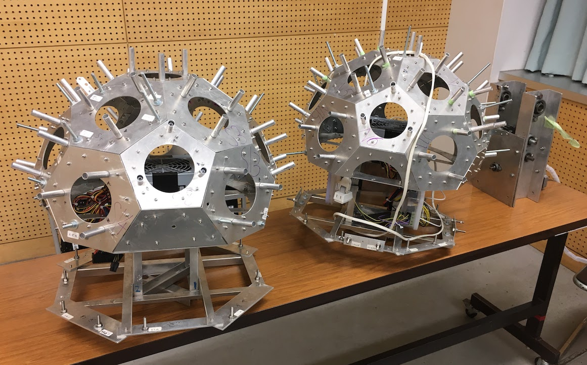
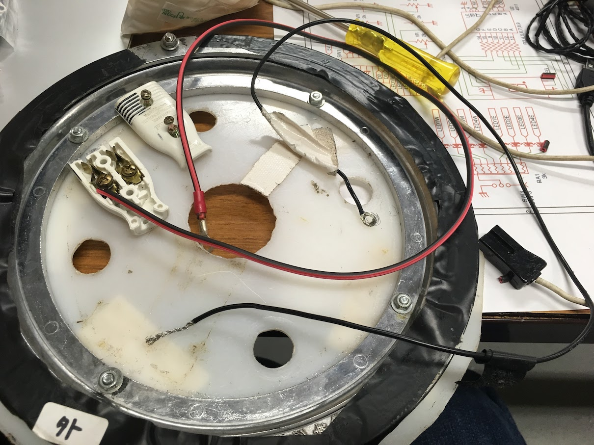
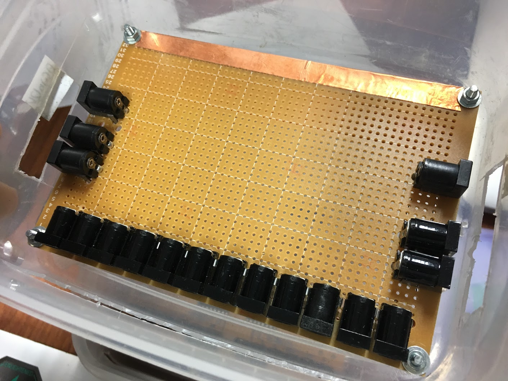
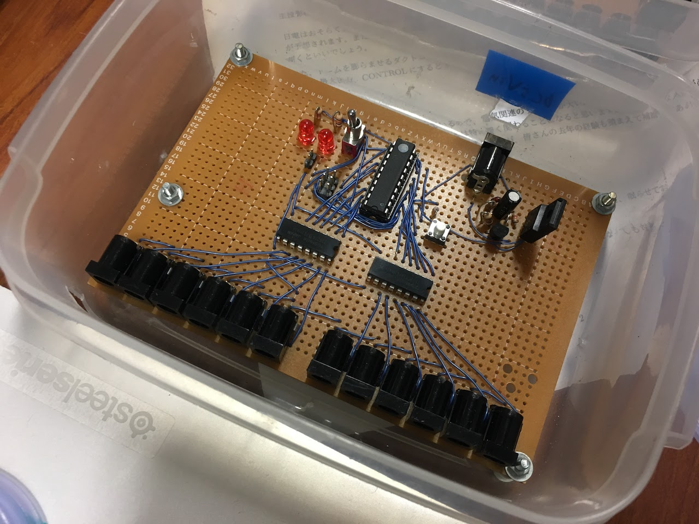
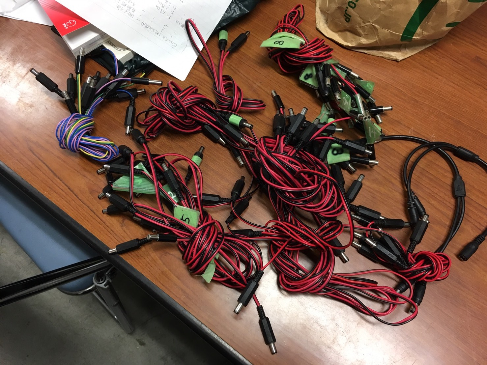

# 配線(かごしい内)
- 書いた人: Kenichi Ito(nichiden_27)
- 更新: Kenta Suda(nichiden_28)
- 更新日時: 2018/08/26
- 実行に必要な知識・技能: 端子のはんだ付けや圧着
- タスクの重さ: 2/数日かかる
- タスクの必須度: 4/毎年やるべき

## 概要
かごしいは、主投影機群を格納し回転させる機構です。
**組み立て・管理**はかごしいチームの仕事である一方、**内部配線**は複雑で手間がかかるので日電も手伝うことになります。

配線に関する引き継ぎはかごしいにもありますが、日電員が全体を把握できるようまとめて解説します。

## 用語解説
かごしいの扱う器具には様々な愛称が付いている。実物を見るのが早いが、それぞれの役割について簡単に解説する。

### かご・しいたけ
主投影機を搭載し、回転する台座。
そのうち半球状になっている部分をその形にちなみ**しいたけ**と呼んでいる。



アルミ合金製だが、無数の板材が組み合わされておりかなり重い。
日電のものを取り付ける際はこの板に括り付けることになるが、**結束バンド**が大変便利である。

### ごきぶり
かごしいたけの土台となる部分。
名称はその黒い塗装から。

塗装は所々剥げており、**しいたけと電気的に接続している**。
そのため、主投影機群の事実上のアースとなっている(アースとして十分でないという指摘がある)。

### 緯度変
緯度変のモータとギアボックスが一体となったもの。
かごしいがごきぶりに設置してくれる。

日周にも言えるが、モータのケーブルが頼りないので、**ごきぶりのどこかにテープで留めておく**こと。

### 日周
日周モータとギアボックス。
同時にかごしいたけを支える回転台座でもあり、かなり大きく重い。

### パンタグラフ
日周が回転していくと、電源ケーブルが巻きついて回転を妨げてしまう。
これを防ぐために、パンタグラフという円盤状の部品を日周とかごしいたけの間に挟む。

構造としてはボールベアリングだが、軸受けとしてではなく回転するボールを通して送電するために使っている。
外輪が地面に対して静止し、内輪が日周に合わせて回転する。
通電中に金属部分に触れると**感電することがある**ので要注意だ。

パンタグラフには接続用のケーブルが外輪・内輪に一本ずつ付いている。
パンタグラフ側は**丸型の圧着端子**をねじで軽く(回転するように)留めている。

圧着端子やねじは外れることがあるので気をつけよう。
圧着端子は部室のパーツケースに相当数のストックがあり、圧着工具も数本保管してあるので、部室が使える状況なら修理は容易だ(**本番では体育館に持ち込んでおく**と安心)。

なお、配線のうちの片方が本番後に断線したので、交換する必要がある。

### 頸動脈
**ケーブルを南北間で通す**ため、日周に開いている穴。
ここを通る線は少ないほどよい。
過去には本番直前にケーブルを増やした結果、それが絡まって断線したこともある。


## 地上からパンタグラフへ
パンタグラフは、ベアリング全体が通電するため**一つの大きな端子**として使われている。
家庭用の交流100Vをしいたけ内部に送るには、当然端子が二つ必要になる。
南北それぞれのパンタグラフを巨大なコンセントのように使っていると理解してほしい。

### 二股ソケット
配線を南北に分離するため、**二股に分かれた電源ソケット(オス→メスx2)**がかごしいの備品に用意されている。
ケーブルはそれぞれ片側一本しかないので、正しい向きに刺さなければ通電しないことに注意。
わかりやすいようにテープが貼ってある。

### 外輪ケーブル
延長コードに二股ソケットを繋げたら、もう一方をパンタグラフの**外輪から伸びるケーブル**と接続する。



写真にあるように、外輪のケーブルには**黒い角形の端子(メス)**がついており、二股ソケット側に差し込めば繋がる。
AC電源のソケットと違い、切り欠きによって向きが分かるため便利である。

ただ、この端子の名称が分からなくなっており、現状壊れた際の買い替えができない状況にある。
通るケーブルは一本なので、**DCジャック**などに交換しても機能は果たせるだろう。

(AC電源ソケットにしてしまうと、内輪と外輪の区別が付きづらくなるのでオススメしない)

## パンタグラフから頸動脈へ
パンタグラフ内輪のケーブルには**AC電源ソケット(メス)**が繋がっている。
地上側とは逆に、南北二本の内輪ケーブルを二股ソケット(オスx2→メス)で一つに束ねよう。

ケーブルを合流させるには、南北どちらかの内輪ケーブルを反対側に持っていく必要がある。
これには、内輪ケーブルを**頸動脈**に通せばよい。
これで、しいたけと一緒に動くAC100Vのコンセントが完成する。

あとは複数口のある延長コードをつなぐだけである。
南北両方で電源が取れるようにするため、一方の**延長コードを頸動脈に通す**。
太い延長コードは頸動脈を通りづらいので、必要に応じ緯度変を回しながら作業すると楽だ。

## 主投影機電源
投影機の電源は直流なので、勿論コンセントにそのまま刺すわけではない。
また、投影機が一つならばACアダプタがあれば良いが、主投影機は数十個ある物が多い。
そこで、**【電源→各投影機の配電回路→(ケーブル)→各投影機】**という順番で接続することになる(数が少ないぎんとうは例外)。

### ACアダプタ
直流を得るにはACアダプタを使うのが最も簡単である。
ただし、主投影機の**消費電力をまかなえるだけの個数を用意する**こと。
ACアダプタの定格を超えて使用すると、寿命を縮めてしまうことがあるので気をつけたい。

26主投時点では、しいたけ内に5V4A(2個)/12V5A(2個)の4つのACアダプタを、結束バンドで固定して給電していた。

28代では電源を12V150WのACアダプター1つにした。
これはPISCIUMやまたたき回路内でレギュレータを用いたため可能となった。
これによりしいたけ内の配線が簡単になり、ATX電源に比べてかなり軽くなったのでかごしい本体への負担も減った。
また、ATX電源より安定して電源を供給できるようになった。


### ATX電源(参考)
27主投では、ケーブルの多くなるACアダプタを廃止してPC用の**ATX電源**を使用した。
しかし、ちょっとした電流サージで停止してしまうというATX電源の仕様により活用は困難だった。
また、当初案ではしいたけに電源装置をねじ止めする予定だったものの、フレームのサイズが合わず断念した。

ATX電源は使い方にかなり難があるので、配電管理にコストを割けないのであればACアダプタを使う方が楽かもしれない。
そのため、28代では12VACアダプタに統一して三端子レギュレータで電圧を下げるという方針をとった。

なんにせよ、

- 配線の作業がしやすいこと
- 本番で安定して電力供給できること

を第一に考えて検討すべきだ。

## 投影機回路BOX
しいたけ上でACアダプタと各投影機の間を繋ぐ回路が入った箱(実際はタッパー)。
**こうとうBOX・いっとうBOX・無線BOX**(Piscium)が存在する。
各投影機の備品を入れる箱も「\*\*ボックス」と称するが別物である。
正直ややこしいので呼び方を変えるべきかもしれない。

### こうとうBOX
恒星投影機16個に電力を供給する回路。
27代まではDCジャックが18個繋がっているだけの簡単なものであったが、28代で[突入電流防止用のNTCサーミスタ](http://akizukidenshi.com/catalog/g/gP-12543/)を入力端子のところに直列で2つずつ取り付けた。
こうとうは一個あたり3Wを消費するので、過大な電流が流れないよう回路を半分の9個ずつに分けてある。

このNTCサーミスタは温度が低い(室温程度)の時は抵抗が1Ω程度だが、電流が流れて温度が高くなると抵抗がほぼ0になる。
そのため突入電流が防げるという仕組みだ。
27でこうとうのONOFFをやろうとしたところおそらく突入電流のせいでできなかったとのことだったので取り付けた。
もしかしたらATX電源をACアダプターに変えたことで突入電流に耐えられるようになっていたかもしれないが、サーミスタはつけたままでも問題ないだろう。




壊れる類のものではないので作り変えは例年行われないものの、27代では大電流を流せるよう基板の裏全体に銅箔を貼り付けた。28代ではNTCサーミスタをとりつけた。

取り付ける部分は、しいたけの下の四角い部分である(他の回路BOXも同様)。
養生テープなどでは剥がれるリスクがあるので、**結束バンドでフレームに固定する**とよさそうだ。

### いっとうBOX
中身は[またたき回路](twinkle.html)。使い方や仕組みはあちらの記事を参照いただきたい。
主投影機配線の要素の一つとして考えるときは、こちらの呼び方を使うことが多い。



### 星座絵BOX
[Piscium](wireless/piscium.html)のこと。
26代までは無線は星座絵だけだったので、この呼び名が残る。

## 投影機ケーブル
**回路BOXと投影機を繋ぐケーブル**は基本的に日電の管理下にある。
例外として、星座絵投影機は慣例的に本体とケーブルが一体なので製作は任せよう。

ただし、28主投において、正座絵のケーブルの部分でショートしてPisciumの一部が壊れるということが起きた(詳細は[Pisciumのページ](wireless/piscium.html))。
ケーブルの制作は正座絵の負担にもなっているので、他の投影機と同様に正座絵も本体にDCジャックをつけるようにして、ケーブルは日電で制作した方が良いかもしれない。
ケーブルを日電で管理すればショートも防げるだろう。

また、現在使われている投影機ケーブルの太さは0.3sqである。
太い線を使うとDCジャック内でショートしやすくなってしまうので注意してほしい。
なお、正座絵のケーブルがショートした原因も太いケーブルを使ったことである可能性が高いので、日電が作るようにしなくても0.3sqの線(正座絵で持っているものではなく部室にある赤黒の線)を使うように指定すればいいかもしれない。

### 二色ケーブル
毎年使うものであり、必要本数は大抵部室にある。
とはいえ、もし足りなくなれば早めに増産しておこう。
適度な長さの二色ケーブルに、DCプラグを2個つけるだけで良い。



### 二分岐ケーブル
ぎんとうは片方の半球に二つしかないため、BOXの代わりに**二つに分岐するケーブル**を挟む。
二分岐は自分で作ると耐久性に難があるので、既製品を使っている。

二つのぎんとうは距離をかなり離して設置されるので、分岐の後さらに**延長ケーブル**を挟まなくてはならない。
他のケーブルと違って一方がDCプラグ、他方がDCジャックとなるので混同しないように。

### 気をつけたいこと

- 投影機の区別をつける
    * しいたけに取り付けると線が絡み合い、元を辿るのは困難を極める
    * **色付きのテープを巻く**など、どれがどの投影機かわかるようにする
- 長さを確保する
    * こうとうやいっとうのケーブルは長くないと上まで届かない
    * 短くて届かないと言われたらすぐ**長いものと交換できる**ようにしておく
- 導通チェックをする
    * 実際使う前に**断線・ショート・+-逆転**がないか確認する
    * 一本のショートでこうとうが半分つかなかったこともあり、甘く見てはいけない
    * テスターでチェックするのは大変なので、23代では下図のような回路を使っていた
        + 正常でなければ二つのLEDが同時に点灯しない仕組み
        + 非常に簡単なので、一つ作っておいてもいいかも(もしくはまだ部室にある??)


## しいたけ内部主投影機配線の全容
最後に、しいたけ内配線の様子をツリー上に示す。
記入してはいないが、こうとうBOXやいっとうBOXにももちろんそれぞれの投影機がつながっている。
Pisciumは全主投影機の電源を制御するので、27代から配線の構造がかなり変化した。

```
[26まで]
電源
├── ACアダプタ12V-1
│   └── こうとうBOX-1
├── ACアダプタ12V-2
│   └── こうとうBOX-2
├── ACアダプタ5V-1
│   ├── いっとうBOX
│   └── 二股DCケーブル
│       └── (各ぎんとう)
└── ACアダプタ5V-2
    └── 星座絵BOX

[27]
電源
├── ATX電源装置+Piscium
│   ├── (各星座絵)
│   ├── 二股DCケーブル
│   │   └── (各ぎんとう)
│   ├── いっとうBOX
│   ├── こうとうBOX1
│   └── こうとうBOX2
└── USB用ACアダプタ
    └── Piscium(無線モジュール)

[28]
電源
└── ACアダプタ12V+Piscium
    ├── (各星座絵)
    ├── 二股DCケーブル
    │   └── (各ぎんとう)
    ├── いっとうBOX
    ├── こうとうBOX1
    └── こうとうBOX2


```


