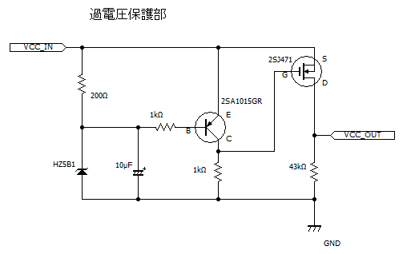

# 過電圧保護回路
- 書いた人: Kenta Suda(nichiden_28)
- 更新日時: 2018/09/28
- 実行に必要な知識・技能: 電子回路の知識
- 難易度: 2/少しやれば可能
- 情報の必須度: 3/必要な場合がある
- 元資料
  + `27日電引き継ぎドキュメント　またたき回路` by Kenichi Ito(nichiden_27)

## 概要
27代までのまたたき回路についていた回路です。
27代まではまたたき回路の電源が5Vであったため、誤って12Vを刺しても壊れないように使っていました。
28代でまたたき回路の電源を12Vに変更したため必要なくなりましたが、あくとうコントローラーなど他の電源が5Vの回路に組み込むなどの利用方法があります。

## 回路

閾値の検出に使用しているのは**ツェナーダイオード**である。
ダイオードには、逆方向に電圧をかけるとある閾値以上の電位差で逆向きに電流が流れ、それ以上電位差が大きくならない効果がある。
その閾値をツェナー電圧という。

通常のダイオードでは非常に高いツェナー電圧だが、ツェナーダイオードは不純物を混ぜることでツェナー電圧を下げている。
またたき回路で使用した`HZ5B1`のツェナー電圧は4.6-4.8V。
カソード側の200Ωの抵抗により、回路全体としての閾値を**5.1-5.2V**としてある。

`VCC_IN`が約5.1V以下の場合、ツェナーダイオードには電流が流れず、`2SA1015GR`はOFFの状態になる。
`2SA1015GR`のコレクタはプルダウンされているので0Vに落ち、FET(`2SJ471`)にはゲート・ソース間電圧が発生する。
従って、FETのソース・ドレイン間に電流が流れ、`VCC_OUT`に入力電圧がそのまま出てくる。

`VCC_IN`が約5.2Ｖを超えると、ツェナーダイオードに逆向きの電流が流れ始める。
`2SA1015GR`にエミッタ・ベース電流が流れることで、コレクタに電流が流れて`2SJ471`のゲート電圧が`VCC_IN`とほぼ等しくなる。
結果、ゲート・ソース間電圧はほぼ0Vとなり、FETがOFFの状態になって電源が遮断される。

この回路の耐圧はツェナーダイオードの許容損失による。
入力が約15Vを越えると許容損失を超え、ダイオードが焼き切れる可能性がある。
仮に焼ききれた場合、ツェナーダイオードに電流が流れない状態と同じになり、入力電圧が`VCC_OUT`に出力されてしまう。
大変危険なので、**高電圧の電源を接続しないよう注意すべきだ**。

保護回路の閾値は、ツェナーダイオードのツェナー電圧やカソード側の抵抗値を調整することで変更できる。
