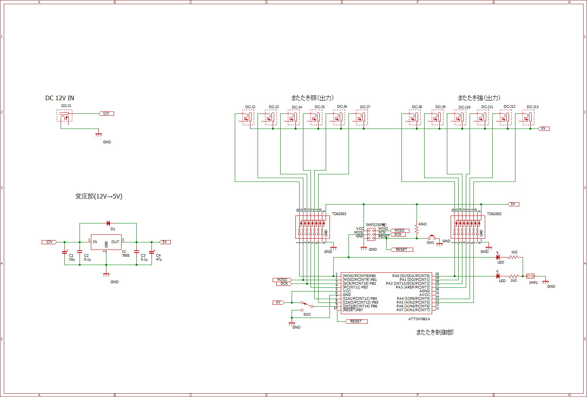

# またたき回路
- 書いた人: Kenichi Ito(nichiden_27)
- 更新: Kenta Suda(nichiden_28)
- 更新日時: 2017/10/4
- 実行に必要な知識・技能: 電子回路、AVRマイコン
- タスクの重さ: 3/数週間
- タスクの必須度: 2/たまにやるべき
- 元資料
  + `一等星投影機付属またたき回路仕様書.docx` by 西村陽樹(nichiden_23)

## 概要
いっとうはただ明るいだけでなく、またたいているように見える効果が付いています。
そのための「またたき回路」の開発は日電に委託されており、遅くとも20主投の頃から存在していました。
現行のプログラム、回路は23が作ったもので、プログラムは27で改造、回路は28で改造して作り直したものです。

## 原理
またたきの再現には様々な方法が考えられるが、ここでは20代から現在まで使われている「**1/fゆらぎ**」と「**間欠カオス法**」による方法を解説する。

### 自然のゆらぎ
またたきのパターンは周期的ではなく、ランダムであるべきだということは直感的にわかるだろう。
ただし、日電が用いたのは完全な乱数ではなく、自然の「ゆらぎ」を擬似的に再現したものである。

恒星のまたたきは、大気の「ゆらぎ」による光の強弱の変化と説明できる。
ゆらぎ(fluctuation)とは、ある量が平均値からずれる現象である。
なかでも、**1/fゆらぎ** は自然現象によくみられ、星のまたたきもこれに分類される。

電子回路などにおけるゆらぎはノイズとして表れる。
ノイズは周波数特性(パワースペクトルと周波数の関係)によって分類されているが、1/fゆらぎによるノイズは**ピンクノイズ** と呼ばれる。
ピンクノイズはパワーと周波数が反比例しており、高周波成分であるほど弱い。
これを可視光に当てはめると波長の長い色が残り、ピンク色に見えるというわけだ。

### 間欠カオス法
従って、いっとうの明るさを1/fゆらぎに近いパターンで変化させればまたたきが再現できる。
1/fゆらぎをプログラムで生成する方法はいくつかあるが、またたき回路では処理の軽い「**間欠カオス法**」が用いられてきた。
これは、漸化式によって擬似乱数を作り出す方法である。
以下に基本となる式を示す。

```math
\begin{aligned}
    \begin{cases}
        X(t＋1)=X(t)+2X(t)^{2} & (X(t)<0.5)\\
        X(t＋1)=X(t)-2(1－X(t))^{2} & (X(t)\geqq 0.5 )
    \end{cases}
\end{aligned}
```

ただし、実はこのままではこの式はあまり実用的でない。
まず、`X(t)＝0.5`の場合、以降のXの値は0に張り付いてしまう。
また、0と1の近傍では値の変化が小さくなりすぎる問題もある。

そこで、実際のプログラムでは上限と下限の付近で若干値をいじるようになっている。
また10進数の浮動小数点演算はマイコンでは時間がかかりすぎるので、実際には`double`型ではなく`unsigned long`型(32bit長整数)の値としてある。

## 回路
北天用と南天用の二つが現存する。
回路は全く同じで、プログラムだけが違う。

**電源電圧は12V**である。
いっとうのユニットやマイコンの電源は5Vであるが、他の主投の電源が12Vであるためそれに合わせて12Vになっている。
それを3端子レギュレータで5Vに降圧して利用している。

もともと27までのまたたき回路は電源電圧が5Vで、12Vを刺し間違えても壊れないように過電圧保護回路が入っていた。
しかし、他の主投と電圧を統一するために28で回路を変更した。

ただし、**いっとうのユニット自体の電源電圧自体は5V**なので、またたき回路を通さずにいっとうを光らせたい場合は12Vをつながないように注意しよう。




回路図を掲載する。
**電源部**(変圧部)、**またたき制御部**(マイコン)、**またたき出力部**(トランジスタアレイ、DCジャック)が主だった構成である。


### スイッチ類


トグルスイッチ(`SW2`)が、**またたきのON/OFFスイッチ** である。
OFFにすると消灯するわけではなく、またたきの効果のない常時点灯となる。
いっとうユニット自体のテストやデバッグに使用することを想定している。

スイッチの近くに設置されたLEDはまたたきの確認用である。
横のジャンパピンを外すと消灯するので、上映中は外しておくとよい。

タクトスイッチは**リセットスイッチ**で、押すとマイコンが再起動する。

### またたき制御部
`ATTiny861A`を使用している。
`SW2`がpin9(`INT0/PB6`)に繋がれており、INT0割り込みを使用してまたたきON/OFFを切り替える。

INT割り込みはI/Oポートが出力設定になっていても機能するので、プログラムでは`PB6`が出力設定になっていても問題ない。
また、ON/OFFの制御をするだけのスイッチであるためチャタリング除去はなされていない。

`PB0`、`PA0`に確認用LEDが接続されている。

### またたき出力部
`TD62003`トランジスタアレイを使用する。
`ATTiny861A`の`PA0-PA5`/`PB0-PB5`の12本が出力ピンとなる。
いっとうとの接続部はφ2.5の基板用DCジャックを使っている。
各出力ピンが`HIGH`になると、対応したDCジャックのGNDが導通して電流が流れる仕組みである。

### 電源部
三端子レギュレータを用いて12Vの電源電圧を5Vに降圧している。
三端子レギュレータの使い方は[このサイト](http://radio1ban.com/bb_regu/)を参考にするとよい。

なお、降圧した7V分は熱として放出される。
放熱効率を上げるために[放熱器](http://akizukidenshi.com/catalog/g/gP-00429/)を取り付けている。
放熱器と接触する面に[放熱用シリコングリス](http://akizukidenshi.com/catalog/g/gT-04721/)を塗ってとりつけよう。

## プログラム
27でプログラムを改修した際、Arduino IDEを使用してビルドと書き込みを行った。
Arduino IDEではメインのソースファイルは.inoという拡張子のファイルになる。
ただし、ベースはC++なので.cppや.hのファイルに分割して記述しても問題ない。

23日電のまたたき回路のプログラムでは**マイコンを実際に動作させる部分**と**またたきパターンを生成する部分**が混在していた。
可読性を高める目的で、前者を`Twinkle.ino`に、後者を`Twinkle.cpp`及び`Twinkle.h`と分けることにした。

`Twinkle.h`で宣言している`Twinkle`クラスがパターン生成のライブラリのように使えることを目指したが、完全なブラックボックスにはできていないので適宜改善が必要。

### Twinkle.h
プログラム中で使う変数・関数の宣言があるファイル。
`NORTH_HEMISPHERE`や`SOUTH_HEMISPHERE`がdefineされているが、これは北天・南天で数値を切り替えるために用いる。
書き込み前によく確かめて、不要な方をコメントアウトすること(片方をコメントにしていないと、変数宣言が二重となりエラーが出る)。

使っている変数や配列の注釈を箇条書きしておこう。

- public変数
    + int bit_num[6]:   パターンの番号とマイコン側のピンの順番の対応を示す
    + unsigned int on[12]:  27で追加した、またたきをピンごとに無効化するための配列。1か0
    + unsigned int on_duration[12]: 一周期のうちLEDが点灯している時間(=またたきパターン)を格納する
- private変数
    + unsigned long shift_chaos:    ピン同士を入れ替える際に使う乱数値
    + unsigned long chaos[12]:  またたきパターン用の乱数値
    + unsigned int min_duration[12]:    on_durationの最小値。大きくするとまたたき効果が強くなる
    + unsigned int refresh_rate/rr_count/shift_rate/sr_count:    (後述)

### Twinkle.cpp
冒頭でいくつか記号定数が宣言されている。
コメントを読めば概ね理解できるであろう。
結局`Twinkle`クラスの内部処理で使うだけなので、ヘッダファイルのクラス宣言の方に書いても問題なかったかも。

```cpp
#define CHAOS_DIV 256 // chaos_gen()で生成される乱数は1~32768の幅であるが、このままではタイマ0割込に使用できないので適当な2の乗数で割る
#define ON_DURATION_MAX 160 // LEDの点灯時間の最大値を決定するパラメーター(タイマ割込の間隔によって決まっているのでオシロスコープで波形を見ながら調整のこと)
#define TWINKLE_RATE 2 // またたき用の乱数値の更新レート、nを設定するとn回のタイマ割込に1回の割合で値が更新する
#define TWINKLE_SHIFT 100 // 乱数の周期性問題を解決するために、乱数とそれに対応する信号出力ビットをport_shift()で変更している。nを設定するとn回の乱数更新に1回の割合で出力がビットシフトする
```

次に、コンストラクタがある。
と言っても変数の初期化をしているだけである。
ここで、`refresh_rate`や`shift_rate`などを設定する。
```cpp
Twinkle::Twinkle():refresh_rate(TWINKLE_RATE),
                   rr_count(TWINKLE_RATE),
                   shift_rate(TWINKLE_SHIFT),
                   sr_count(TWINKLE_SHIFT){};
```

#### port_shift()
間欠カオス法はあくまで擬似乱数なので、周期性が目立つことがある(らしい)。
定期的にまたたきパターンと各出力ピンの対応を変えることで、これを防ぐ。

**ただし、このメソッドは現在使用していない。**
23では12のピンを強弱2種類にしか分けていなかったが、27で惑星(またたかない)を追加したのでこれが3種類に増えた。
当初それに気づかず実験したところ、またたき強・弱・惑星が数秒で入れ替わってしまう。
修正の時間も限られており、本番ではポートの入れ替えを使わずに投影をすることとなった。
見ていた限りでは特に不自然には感じなかったが、この仕様が必要かどうかは更なる検証を待ちたい。

参考のためにピンを入れ替える仕組みを解説する。
```cpp
for(int i=0;i<6;i++)
    bit_num[i] = (bit_num[i] + (shift_chaos >= 12000 ? 1 : 4)) % 6; // 6要素の数列を左に回転シフト
```
回転シフトは、配列の中身を押し出して溢れた分を逆側に追加するものだ。
円環状に並んだ数字を回転させるイメージである。
アルゴリズムとしてはある数字(6要素なら1~5)を足し、6以上になった要素からは6を引くというものだ。
6で割った余りを保ったまま6を下回ればいいので、**実は割り算して余りをとるだけでもいい。**

なお、23の計測によるこの処理の実行時間は100μsだが、割り算の方法で処理を簡略化したので短くなったかもしれない。

#### refresh()
またたきパターンの更新を行う。
`chaos`の12個の要素それぞれに、新たな乱数値を格納している。
```cpp
void Twinkle::refresh(void){ // 乱数値を更新する。所要時間は12変数で1ms
  for(int i=0;i<SIZE_OF(on_duration);i++){
    chaos[i] = chaos_gen(chaos[i]);
    on_duration[i] = min((int)(chaos[i] / CHAOS_DIV + min_duration[i]), ON_DURATION_MAX);
  }
}
```

実際のまたたきパターンで使う`on_duration`には、`chaos`から二つの変化を加える。
まず、最大32768の出力を`CHAOS_DIV`で除した上で、`min_duration`という数を加えている。
`min_duration`が大きいほど、**LEDが点灯している時間が増え、またたきの効果が薄まる**。

また、`on_duration`は160を超えてはいけないので、`ON_DURATION_MAX`と比較して小さい方を採用する。
実行時間は1msらしい。

#### chaos_gen(y)
入力yに対して間欠カオス法による擬似乱数を一個出力する。
元の漸化式にアレンジを加え、yの変化が微小になることがないよう調整してある。
```cpp
unsigned long Twinkle::chaos_gen(unsigned long y){ // Max == 32768までの整数値を返す疑似乱数(1/fゆらぎ)
  if(y < 1638) y += 2 * pow(y, 2) / 32768 + 1966;
  else if(y < 16384) y += 2 * pow(y, 2) / 32768;
  else if(y > 31129) y -= 2 * pow(32768 - y, 2) / 32768 + 1310;
  else y -= 2 * pow(32768 - y, 2) / 32768;
  return y;
}
```

#### generate()
またたき生成や出力ピンの入れ替えを制御する。
タイマ割り込みで毎回呼ばれることを想定している。

割り込みが入るたびに`rr_count`と`sr_count`が1ずつ減少し、0になると`port_shift()`や`refresh()`を実行する。
ただし、27の仕様変更で`port_shift()`は不使用としたので、その部分はコメントになっている。
```cpp
void Twinkle::generate(void){ // またたきをつかさどる部分
  rr_count--; //乱数更新時期の判定と実行をする
  if(!rr_count){
    sr_count--; //ビットシフト更新時期の判定と実行をする
    if(!sr_count){
      //port_shift();
      sr_count = shift_rate;
    }else _delay_us(100);
    refresh();
    rr_count = refresh_rate;
  }else _delay_us(1100); //それらの操作をしない場合でも、同じだけの時間waitして調整する
}
```

### Twinkle.ino
AVRマイコンの制御に直接関連するコードはこちらにまとめた。

#### ISR(INT0_vect)
INT0割り込みで呼ばれる。
PORTAとPORTBをすべてH、つまり常時点灯・またたきなしの状態にする。

```cpp
ISR(INT0_vect){ //またたきOFF（スイッチで切り替え）
  PORTA = 0xFF;
  PORTB = 0xFF;
}
```

#### ISR(TIMER0_COMPA_vect)
タイマ0割り込みで呼ばれる。
PORTAとPORTBをすべてHにしてから、Twinkleクラスの`generate()`関数を呼んでパターンの更新処理をする。
```cpp
PORTA = 0xFF;
PORTB = 0xFF;
twinkle.generate();
unsigned int c_up = 0;
```
以降は、実際にピンから出力するコードになる。
`pattern_count`は出力ピンの数(現状12)を表す。

forループ内では、7μsごとに`c_up`をインクリメント(コメントに`twinkle.c_up`とあるがこれはミス)していく。
`twinkle.on_duration[i]`と一致したら`pattern_count`を一つ減らして、`twinkle.on[i]`が0でなければLEDを消灯する。
`i`とピン番号の対応は`twinkle.bit_num`に書いてある。
```cpp
 unsigned int pattern_count = SIZE_OF(twinkle.on_duration);
 while(pattern_count){ //twinkle.on_durationの値とtwinkle.c_up（カウントアップ）の値を比較し、一致するまではON、一致したらLEDをOFFにする。全部OFFになったらループを抜けてmainに戻る。
   c_up++;
   for(int i=0;i<SIZE_OF(twinkle.on_duration);i++){
     if(twinkle.on_duration[i] == c_up){
       pattern_count--;
       if(!twinkle.on[i]) continue;
       if(i < 6) PORTA ^= 1 << twinkle.bit_num[i];
       else PORTB ^= 1 << twinkle.bit_num[i-6];
     }
   }
   _delay_us(7);
 }
```
出力ポートの制御であるが、マイコンボードのデジタル出力のようには便利でなく、**出力レジスタというものを使う**。
`PORTA`や`PORTB`とあるのが出力レジスタで、ピンの状態が二進数で保存されている。
これを書き換えることで出力がなされる仕組みだ。

例えば、`PORTA = 0xFF(11111111)`の時に、6番目のピンを`LOW`にしたいとする。
`^=`演算子はXOR代入といい、右の数との排他的論理和を代入する。
XORは二つの数が違えば1、同じなら0を返すので、`PORTA`の6桁目と1のXORを取ればそこだけが0になる。
n桁目が1の数は1を(n-1)ビット左にビットシフトすると作れるので、コードはこうなる。
```cpp
PORTA ^= 1 << 5
```
#### main()
初期設定とメインルーチン。
I/Oポートの設定・タイマ0(CTCモード)とプリスケーラの設定・タイマ0割り込みの設定・INT0割り込みの設定を行っているらしい。
ここを変更したければAVRの勉強をしよう。

`sei()`は割り込みを許可する組み込み関数である。
設定終了後にこれを呼んで無限ループに入り、割り込みを待つことになる。
```cpp
int main(void){
  /*** 初期設定(TIMER0_CTC、TIMER割込、INT0割込) ***/
  _delay_ms(100);
  DDRA = 0xFF; //PORTA0~7を出力に設定
  DDRB = 0xFF;
  /*タイマ0 CTCモード、タイマ0_Compare_A割込*/
  TCCR0A = 0x01; //CTC0をHに
  TCCR0B = 0x00 | 1<<CS02 | 0<<CS01 | 0<<CS00;
  OCR0A  = 180; //CTCのMAX値の設定(180、プリスケーラ256の設定でタイマ割込間隔は7.5msec)
  TIMSK |= 1<<OCIE0A | 0<<TOIE0; //タイマ0CompA割込有効
  GIMSK |= 1<<INT0; //INT0割り込み有効
  MCUCR |= 0<<ISC01 | 0<<ISC00; //INTピンのLowで割り込み発生
  PORTA  = 0x00;
  PORTB  = 0x00;
  /*************************************************/
  sei();
  for(;;){}
}
```

### 書き込むには
書き込みの際、Fuseビットの`DIVCLK8`を`Disable`する必要がある(内部クロックを1MHzではなく8MHzで使用するため)。

27では、書き込みにArduino IDEを使った。
Arduinoの中身はAVRマイコンなので、マイコン(ボード)の定義を読み込む事で書き込み可能になる。
ボードマネージャで[設定ファイルのURL](http://drazzy.com/package_drazzy.com_index.json)を指定すると各種設定が選べるので、`ATTiny861A`を選択して書き込もう。

手順の詳細は[Arduino IDE に ATtiny45/85/2313 他の開発環境を組み込む](http://make.kosakalab.com/make/electronic-work/arduino-ide/attiny-dev/)など参照。


## 改善点
現在のまたたき回路は起動に時間がかかるため、いっとうも無線制御にしようとしても、どうしてもONにしてから点灯するまでにラグが生じてしまう。
現在の間欠カオス法による1/fゆらぎの再現は現実に近いものなのかもしれないが、再現性を少し犠牲にしてでも、処理が軽く起動の速い新しいまたたき回路を作ることを考えてもいいかもしれない。
もしくは、またたき回路自体を無線制御できるようにするという手も考えられる。