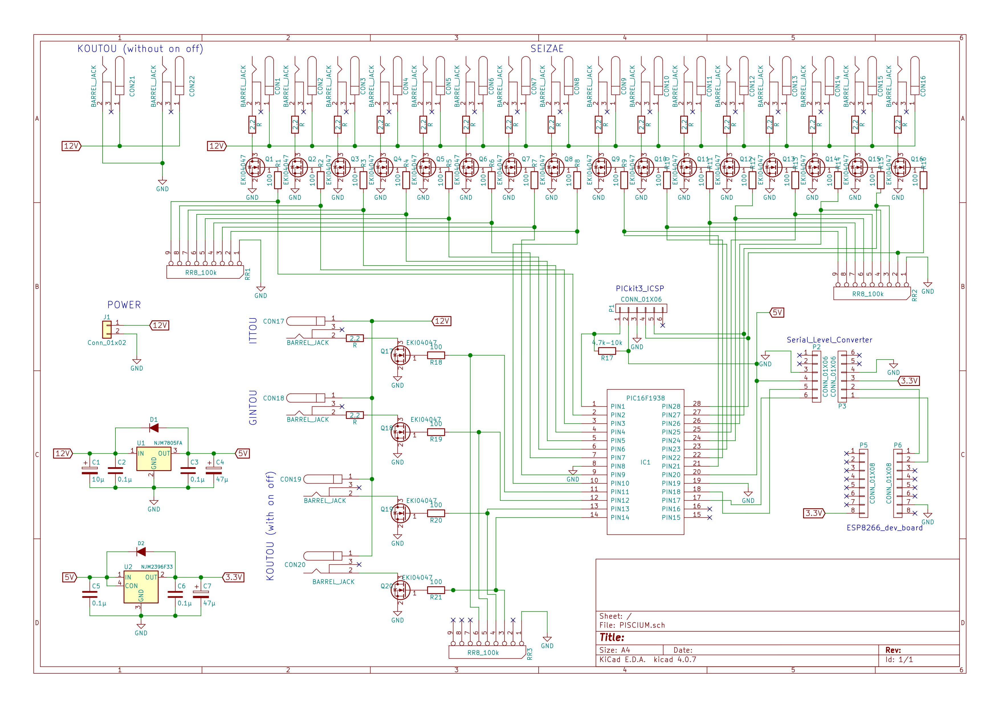

# 無線制御(PISCIUM)

- 書いた人：眞木俊弥(nichiden_27)
- 更新：Kenta Suda(nichiden_28)
- 更新日時：2018/10/4
- 実行に必要な知識・技能：電子工作の経験、電子回路について一通りの知識、マイコン（Arduino, PIC)、インターネットの仕組み
- タスクの重さ: 4/一月はかかる
- タスクの必須度：5/しないとプラネ終了

## 概要

※とりあえず使えるようにするだけだったら、**概要**と**使い方**の部分を理解すれば大丈夫です。ブラックボックスになるように設計しました。ただ、故障した…とかいうことになったら、頑張って**技術仕様**のところを理解するか、いっそのこと全部作り直してください。

プラネタリウムの公演と、外で星をぼんやりみている時の差とは何でしょうか？
それは、ずばり、分かりやすい解説やワクワクするストーリーがあるないかです！
そして、その演出をサポートしてくれるものは何と言っても様々な神話や逸話に彩られた星座でしょう。
ただ、一般の人には満天の星空の中から星座を見つけ出すことは至難の技なので、プラネタリウムでは、「星座絵」を投影します。
そのため、ナレーションに合わせて星座絵を点灯・消灯する必要があります。
ただ、投影機からたくさん線を引き出してしまうと、日周・緯度の変化の際の回転で絡まってしまうため、我々のプラネタリウムでは、無線制御を行っています。

27代では、新たに無線制御装置を作り直しました。
その名も、`PISCIUM`(Planetarium Integrated Stars and Constellation Images Utility Module)です！！
`PISCIUM`を使うことで、みなさんよくお世話になっているWi-Fiネットワークを介して、パソコン、スマホ、タブレットなどWi-Fiの接続可能な端末から星座絵などのかごしい内部の投影機を無線で制御できます。

28代で電源回りを設計し直し、細かいところを修正して作り直しました。

## 使い方

`PISCIUM`はそのほかのボックス類と同じように、（百均）タッパーを加工したケースに収められています。
かごしいの側面に固定して使うことを想定しています。
また、事前に部室にあるはずの無線Wi-Fiルーターの電源を入れておきましょう。

使用するには、電源を接続し、出力用の側面のDCジャックに星座絵などの投影機を接続してください。
使用している電源は、[12V150WのACアダプター](http://akizukidenshi.com/catalog/g/gM-09089/)です。

`PISCIUM`を上から見たときに、DCジャックが見えていない方を下側面としたときに、

- 上側面の一番左以外と右側面が星座絵(12V)。全部で16ポート。ポート1からポート16まで。
- 左側面が、下から、こうとうONOFFなし(12V、2つ)、こうとうONOFFあり(12V、2つ)、いっとう(12V)、上側面の一番左がぎんとう(12V)

となっています。

こうとうのポートだけは他と仕様が違うので注意してください。
また、いっとうとぎんとうは星座絵と仕様が全く同じなので入れ替えることができます。

無線Wi-Fiルーターに自動的に接続されるので、ブラウザで特定のURLにアクセスすることで制御が可能になります。
ブラウザでの制御に関しては、Webアプリケーション`Acrab`があるので、[そちらの説明](acrab.html)を参照してください。

また、基本的に給電は上記のように12V150WのACアダプターを電源用のコネクタに刺して行いますが、軽くテストしたいだけなのにかごしいに固定してある電源を利用するのは大変だと思います。
そのようなときは、ONOFFなしのこうとうのポートのどちらかに12Vの普通のACアダプター(端子がDCプラグのもの)を刺すと`PISCIUM`に給電ができます。

ただし、これはあくまでもテスト用の給電なので、星座絵を何個も同時に点灯させたい場合や、こうとうをつけたい場合など大電力を使う場合(ACアダプターの定格電力を超える場合)は正しい給電方法を行ってください。
また、**2つ以上の電源から同時に給電しない**ようにしてください。

### 使用上の注意点

- 電源がついた状態での各投影機の抜き差しは故障の原因になるのでやめてください。

- ATX電源からACアダプターに変えたため電源が落ちることはなくなりましたが、万が一電源が落ちて再起動した場合、Wi-Fiモジュールも再起動します。
Wi-Fiモジュールが再起動した後、設定を送り直すため`Acrab`のページを再読み込みする必要あります(これは欠陥なので改善されるべき)。

- かごしいのグラウンドが弱いため、稼働している間に全体が帯電してしまうようです。
27代の公演でも、公演中に火花が飛び散り、空中放電して一瞬ブラックアウトしたことがあります。
**かごしいのアース接続を何とかする必要があります。**
そうでないと最悪の場合、火花放電により出火します。
かごしい本体とは導通していることは確認しているので、かごしいか、それと導通しているごきぶりをアースしてください。
アースするときは、より線ではなく、単芯の太めの導線を使用し、体育館の柱など地面に突き刺さっている大きい金属に接続してください。
アースしただけで治るのかはよくわかりませんが、アースしてないのはまずいです。

28代ではその指摘を受けて、赤黒の太い線(より線ではあるが)を使って、片側はごきぶりの下の方にあるボルトに挟み、もう片側をバレーボールの支柱を立てる土台に固定してアースをしました。
そのおかげか28代では火花が散ることはありませんでした。
ただし、かごしいを触ると静電気のようなものを感じることは何度もあったので、帯電はしていたようです。
27代よりも頻繁に(毎公演の前に)調整を行っていたので、アースのおかげではなく、人間を通じて放電していただけなのかもしれないです。

- また、グラウンドが弱く、サージに耐えられないので、こうとうの制御は27代の時点では不可能（電源が落ちてしまう）でしたが、28代で電源を変えたのと、こうとうboxに突入電流防止用のサーミスタをつけたことで、こうとうの制御が可能になりました。
しかし、本番直前にPICのこうとうの制御をしているピンが壊れてしまい、本番はこうとうはONOFFなしのポートに接続し、常時つけっぱなしにしていました。
単純に経年劣化の可能性もありますが、こうとうをONOFFする際のサージにPICが耐えられなかった可能性があります。
実際、こうとうはあおとうやしるとうの光で見えなくなるので、公演の際にONOFFをいじる手間を考えると常時ONにするという選択肢もあるでしょう。

- いっとうの制御は可能ですが、いっとうボックスのまたたき回路の起動に時間がかかり、点灯までにタイムラグが生じるので、現時点では行える状況にありません。
またたき回路のプログラムを変更して、すぐに起動できるようにする、またはまたたき回路に無線の機能をつければいっとうの制御もできるようになるでしょう。

## 技術仕様

27代、28代で作成したファイルは全て[Githubレポジトリ](https://github.com/Triangulum-M33/nichiden28)においてあります。

### 回路

主な部品としては、Wi-Fiの制御を行う`ESP8266`というSoC(System on Chip: マイコン、通信制御回路などが一つのチップの中に収まっているもの）の開発ボード、`ESP8266`からのシリアル通信を受信して各DCジャックを制御するPICマイコン、DCジャックの電流をスイッチングするFETから構成されています。

こうとう以外のポートには、DCジャックの付け根に2.2Ωの抵抗(定格1W)が入っています。
これは、27代において、各投影機をONにした際の突入電流によって電源が落ちるということが何度も起きたため、その突入電流を制限するために28代出つけました。
これで理論上突入電流は最大でも(12/2.2=)5.5Aまでしか流れないです。
こうとうに関しては特に大電流を流すので、こうとうbox側で別途突入電流対策をしています。

しかし、実際は28代でATX電源をACアダプターに変えたことで電源が落ちるという問題は解決されていた可能性もあり、この抵抗の意味があるのかはいまいち不明です。
さらに、28代で実際にあった事例として、星座絵のユニットの部分でショートしていたことがあり、電流を流しすぎてこの抵抗が焼き切れた(見た目上はわからないが電流が流れなくなる)ことがあります。
これは一度だけでなく何度も起きた事例で、抵抗を交換する手間がかかりました。
ただし、これは一概に悪いこととは言えず、もし抵抗がなかったらFETやもっと大事な部分が壊れていた可能性もあり、ヒューズのような役割を果たしていたともいえます。
かごしいに固定したままでも抵抗を交換できるような機構を作るのが一番良いのかもしれません。

### ESP8266の開発ボード周りのソフトウェア

（中華製の安物の）Wi-Fi入りマイコンボードを利用しています。
この`ESP8266`は、`Xtensa`というアーキテクチャを採用していますが、有志により、Arduino IDEで開発できるようになっていて、Wi-Fiサーバーなどの高度なプログラムもライブラリとして整備されていて、我々素人にとっては非常に開発のしやすいモジュールです。
また、今回使用しているボードには、すでに書き込み用の回路も付いているので、USBでパソコンに接続するだけで開発できます。
ただ、USB-シリアル変換素子はArduino純正のものとは違うので、ドライバをインストールする必要があります。
USB-シリアル変換素子の型番は、`CH340g`です。Githubとか製造元のサイトからドライバ落としてきてインスコしてください。
また、ボードの書き込み設定などは、[このサイト](http://trac.switch-science.com/wiki/esp_dev_arduino_ide)などを参照してください。
"ESP8266 書き込み"とかでググるとわんさか出てくるはずです。

27代が開発したプログラムは、`ESP8266`上でwebサーバー（のようなもの）を動かし、特定のURIのGETリクエストを受け取ると、シリアル通信でPICマイコンに点灯状況を送信する形になっています。
IPアドレスは、固定IPで、北天が192.168.11.100、南天が192.168.11.101になっています。

#### 使い方

[Wikiへのリンク](https://github.com/macv35/nichiden27/wiki/Piscium#usage)

>Send GET request to certain url.

>1. **Refresh Confirm**  
>(example) http://(ip)/refresh_confirm/status.json
>1. **Set Port**
>Set ON/OFF of each port.  
>(example) http://(ip)/setPort/status.json?P01=0&P02=1
>1. **Set Constellation Name**  
>Change names of pin used in communication.  
>(example) >http://(ip)/setConstellationName/status.json?p01=And&p02=Aql...
>1. **All Set**  
>Set all port ON.  
>(example) http://(ip)/allSet/status.json
>1. **All Clear**  
>Set all port OFF.  
>(example) http://(ip)/allClear/status.json

以上の5種類のコマンドが用意されています。
通常の公演時は、`Acrab`がこの辺のことはやってくれるはずですが、回路関係のデバッグをする際には、手持ちのスマホとかでこれらのURIにアクセスしながらやると楽です。

`ESP8266`が正しくURIをパーズすると、シリアル通信（UART）でPICマイコンにコマンドが送られます。
"NS"の2文字を送ったあとに、各DCジャック（ポート）20個分の点灯状況を点灯の時"1"、消灯の時"0"として、20文字分送ったあとに、23文字目に"\\n"（改行）をパケットとして送るプロトコルを使用しています。
名付けてNS（Nichiden Seizae）プロトコル…雑です、はい、すみません。
まあ、どうせUARTなんだし、こんな雑なプロトコルでも問題は起きていませんのでご安心を。

また、UARTでPICにパケットが送られるのと同時に、GETリクエストに対して、現在のステータスを表したjsonを返します。

参考までに、ソースコードのリンクをつけておきます。
（汚いのであんまり見ないでー。URIパーザーの部分とかは他のクラスに分けるとかするべきだった。）

[Arduinoのスケッチ](https://github.com/macv35/nichiden27/blob/master/PISCIUM/PISCIUMServer/PISCIUMServer.ino)

### PICマイコンのソフトウェア  

`ESP8266`から送られてきたシリアル通信をデコードして各ポートのFETをオンオフするだけの子なので、大したことはしてないです。
`ESP8266`は3.3V駆動なのに対して、PICは5Vで駆動しているので、間にシリアルレベル変換素子は入れてあります。
MPLAB Xのプロジェクトファイルが引き継ぎ資料の`/pic_decoder/`ディレクトリに入っています。
もし万が一、PICが壊れたりした場合は、`PICkit3`を差し込めるピンヘッダを用意しておいた(28で作り替えた際に書き込み用のピンヘッダを省略して作りました。必要に応じて追加してください)ので、PICを交換して書き込み直してください。
書き込み方は、[PICkit3の使い方](http://ww1.microchip.com/downloads/jp/DeviceDoc/52010A_JP.pdf)をみてください。
